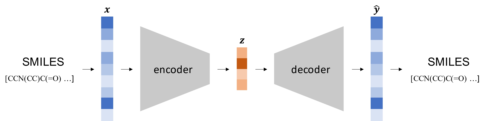
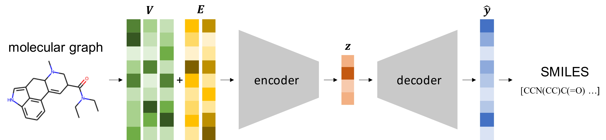

# ednn

In the course of my master's thesis, entitled *A Deep Learning Approach to generate latent representations of molecules as a feature for predictive Life Cycle Assessment*, I engaged in the development and implementation of Encoder-Decoder Neural Networks (EDNNs). This research was predicated on a transfer learning paradigm, with the objective of generating dense molecular representations. These representations were designed to augment training environments where data sparsity is prevalent.

The core of my investigation encompassed two principal frameworks: the autoencoder and the translator.

**Autoencoder:**

The autoencoder framework functions by encoding a molecular string representation, denoted as $\mathbf{x}$, into a latent vector $\mathbf{z}$. Subsequently, the framework endeavors to reconstruct the original representation, outputting it as $\mathbf{\hat{y}}$.

**Translator:**

Conversely, the translator framework commences by encoding a graph representation of a molecule, symbolized as $\mathcal{G}$, into a latent vector $\mathbf{z}$. The primary objective here is to reconstruct a string representation of the molecule, denoted as $\mathbf{\hat{y}}$.

Throughout this research, my experimental work involved extensive utilization of Recurrent Neural Networks, Convolutional Neural Networks, and Graph Neural Networks, exploring their efficacy in the context of the aforementioned frameworks.

The findings of this thesis have been published in the ACS Sustainable Chemistry & Engineering journal and can be accessed via https://doi.org/10.1021/acssuschemeng.2c07682. The purpose of this project is to showcase selected code snippets and the developed models, demonstrating their practical applications and underlying methodologies.
